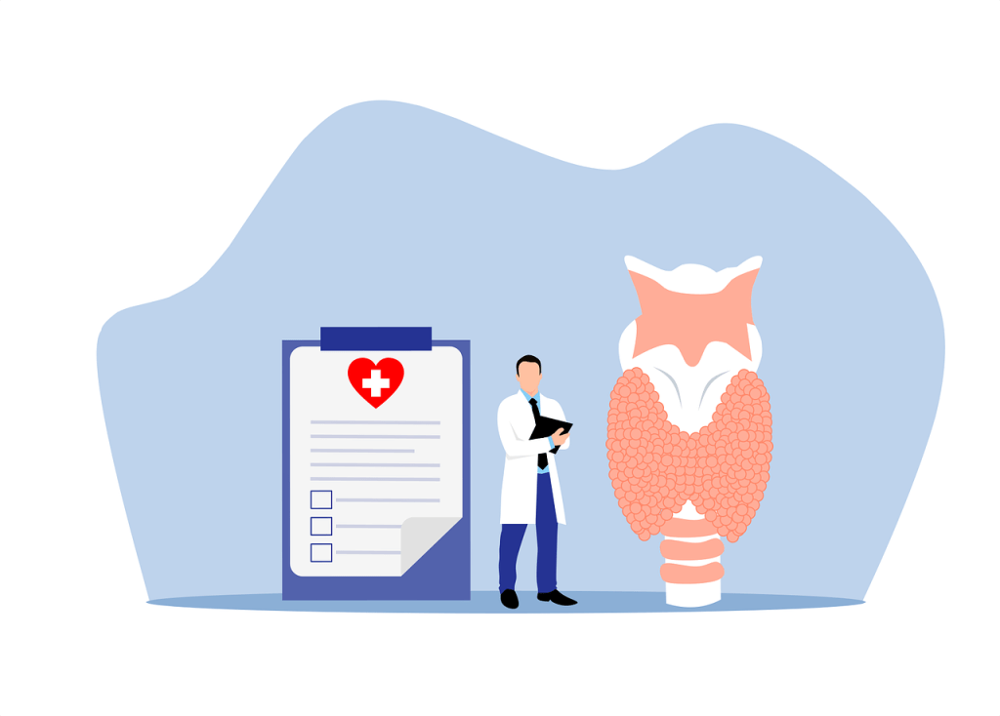

Bienvenidos a nuestra guía exhaustiva sobre todo lo que necesitas saber sobre el hipotiroidismo subclínico. Esta enfermedad afecta a millones de personas en todo el mundo y puede provocar una serie de síntomas y complicaciones de salud si no se trata. En este artículo, exploraremos los síntomas, el diagnóstico y las opciones de tratamiento del hipotiroidismo subclínico. También hablaremos de los remedios naturales y los cambios en el estilo de vida que pueden ayudar a controlar esta enfermedad. Así que, tanto si te han diagnosticado recientemente hipotiroidismo subclínico como si simplemente te interesa saber más sobre esta afección, sigue leyendo para descubrir toda la información esencial que necesitas conocer.

## ¿Qué es el hipotiroidismo subclínico?

El hipotiroidismo subclínico es un trastorno que afecta a la glándula tiroides y que se manifiesta cuando el órgano no segrega adecuadamente la hormona tiroidea, aunque sigue estando dentro del rango normal. Aunque suele ser asintomática, esta afección puede afectar a la salud general. El diagnóstico se hace con análisis de sangre que miden los niveles de TSH y de hormona tiroidea. Puede que no sea necesario un tratamiento inmediato, aunque el control de la función tiroidea es esencial para evitar posibles complicaciones.

Varios factores pueden provocar hipotiroidismo subclínico, como los trastornos autoinmunitarios, la carencia de yodo y ciertos medicamentos. Las mujeres mayores de 60 años son especialmente propensas a padecerlo. Si no se trata, puede evolucionar a trastornos tiroideos más graves, como hipotiroidismo o hipertiroidismo. Por tanto, si una persona sospecha que puede tener hipotiroidismo subclínico, o tiene antecedentes familiares de problemas de tiroides, es importante que consulte a un profesional sanitario. Mediante un diagnóstico y un tratamiento adecuados, se puede preservar la salud y el funcionamiento del tiroides, evitando posibles complicaciones.

## ¿Cuáles son los síntomas del hipotiroidismo subclínico?

El hipotiroidismo subclínico es un trastorno que padecen muchas personas, sobre todo mujeres y ancianos. Al principio, puede no haber ningún síntoma, por lo que es difícil detectarlo sin un análisis de sangre. Sin embargo, a medida que avanza, los indicios pueden ser leves o graves. Pueden ser cansancio, aumento de peso, caída del cabello y piel seca. Los signos del hipotiroidismo subclínico pueden ser menos pronunciados que los del hipotiroidismo manifiesto, pero aun así influyen sustancialmente en la calidad de vida del individuo. Por tanto, es necesario reconocer los síntomas del hipotiroidismo subclínico para recibir un tratamiento y una gestión adecuados.

Los indicios del hipotiroidismo subclínico pueden ser discretos y fáciles de pasar por alto o achacar a otra causa. Los síntomas más frecuentes son sentirse perezoso o fatigado, tener la piel o el pelo secos y estreñimiento. Otros signos pueden ser sentir frío todo el tiempo, debilidad muscular o dolor articular, o dificultad para concentrarse. Aunque puedan parecer triviales, es imprescindible reconocerlos como posibles señales de advertencia de hipotiroidismo subclínico, sobre todo si persisten o empeoran.

Además de los síntomas físicos del hipotiroidismo subclínico, también pueden aparecer síntomas emocionales y mentales. Las personas con esta afección pueden experimentar depresión, ansiedad o cambios de humor. También pueden tener dificultades para dormir o estar fácilmente irritables o inquietas. Es importante reconocer que estos síntomas pueden estar asociados al hipotiroidismo subclínico y buscar orientación médica si persisten o interfieren en la vida cotidiana.

Si crees que puedes tener hipotiroidismo subclínico, es importante que hables con tu médico. Un análisis de sangre puede medir tus niveles de hormona tiroidea para determinar si padeces esta enfermedad. Aunque te diagnostiquen hipotiroidismo subclínico, el tratamiento puede no ser inmediato, aunque puede recomendarse su seguimiento y control. Si reconoces los síntomas del hipotiroidismo subclínico, puedes tomar medidas para controlar tu enfermedad y mejorar tu salud y bienestar generales.

## ¿Cómo se diagnostica el hipotiroidismo subclínico?

El diagnóstico del hipotiroidismo subclínico puede ser complicado, ya que los síntomas pueden no ser evidentes al principio. Para iniciar el proceso, suele hacerse un análisis de sangre para evaluar las cantidades de hormona estimulante del tiroides (TSH) y tiroxina (T4) en el torrente sanguíneo. Los niveles de TSH elevados y los de T4 normales pueden indicar hipotiroidismo subclínico, aunque estas cifras no siempre son fiables. Por lo tanto, hay que estudiar la historia clínica y las indicaciones antes de llegar a un diagnóstico.

Pueden ser necesarias pruebas adicionales para confirmar el diagnóstico de hipotiroidismo subclínico. Esto podría incluir una ecografía tiroidea para ver si existen irregularidades o nódulos. También puede realizarse una biopsia para inspeccionar cualquier nódulo localizado. Además, los médicos pueden realizar un seguimiento de los niveles de TSH y T4 de los **pacientes con hipotiroidismo** sospechosos a lo largo del tiempo para observar si se producen cambios y si aparece algún síntoma.

Es imprescindible que las personas con hipotiroidismo comuniquen cualquier indicio que encuentren, ya que esto puede ayudar a los médicos a realizar un diagnóstico preciso. Además, deben informar a su médico de cualquier medicamento o suplemento que estén tomando, ya que pueden afectar al funcionamiento del tiroides y podrían influir en la precisión de las pruebas. Colaborando estrechamente con el médico, las personas pueden garantizar un diagnóstico rápido y preciso del hipotiroidismo subclínico.

## ¿Qué tratamientos existen para el hipotiroidismo subclínico?

El hipotiroidismo subclínico es un trastorno muy extendido que puede ser asintomático, pero que puede provocar graves problemas de salud si se descuida. Afortunadamente, existen numerosos enfoques para tratar esta afección. La terapia hormonal sustitutiva, que consiste en tomar hormonas sintéticas para sustituir las que el cuerpo no produce, es un tratamiento habitual y puede ser muy eficaz para controlar los síntomas y evitar complicaciones. Es importante trabajar con un médico para asegurar la dosis perfecta y controlar continuamente los niveles hormonales.

Además de los tratamientos médicos, los cambios en el estilo de vida pueden ser beneficiosos. Tales modificaciones pueden implicar llevar una dieta adecuada, hacer ejercicio con regularidad y disminuir el estrés. Esto puede ser beneficioso para la salud en general y también puede ayudar a aliviar los síntomas del hipotiroidismo subclínico. Algunos remedios naturales, como los suplementos de hierbas o la acupuntura, también pueden resultar útiles, pero es necesario ponerse en contacto con un médico antes de probar nada.

Los medicamentos son otra opción para tratar el hipotiroidismo subclínico. Actúan animando a la glándula tiroides a producir más hormonas o dificultando la producción de determinadas hormonas. Sin embargo, estos medicamentos pueden tener efectos secundarios y pueden no ser adecuados para todo el mundo. Un médico puede ayudar a decidir si la medicación es la opción adecuada.

Es esencial recordar que el hipotiroidismo subclínico es una enfermedad crónica que requiere un tratamiento continuo. Aunque los síntomas mejoren con el tratamiento, es vital mantenerse en contacto con un médico para controlar los niveles hormonales y ajustar el plan de tratamiento si es necesario. Manteniéndose al día y colaborando con un médico, se puede controlar con éxito el hipotiroidismo subclínico y llevar un estilo de vida sano y activo. Para garantizar un tratamiento adecuado, es importante que estés atento a tu correo electrónico para recibir instrucciones adicionales de tu médico.

## ¿Se puede tratar el hipotiroidismo subclínico con remedios naturales?

Muchos pacientes de hipotiroidismo subclínico se preguntan si existe algún remedio natural para tratar su enfermedad. Aunque no existe una respuesta universal, algunos estudios proponen que ciertos remedios naturales pueden ser ventajosos. Por ejemplo, un estudio publicado en Clin Endocrinol reveló que la combinación de selenio y tiroxina podía mejorar el funcionamiento del tiroides en algunas personas con hipotiroidismo subclínico. Es esencial tener en cuenta que los remedios naturales no deben utilizarse para sustituir al tratamiento médico, y que sólo deben emplearse bajo la orientación de un profesional sanitario.

Otro posible remedio natural para el hipotiroidismo subclínico es la ashwagandha, una hierba utilizada habitualmente en la medicina ayurvédica. Varios estudios han descubierto que la ashwagandha puede ayudar a mejorar el funcionamiento de la tiroides y reducir los síntomas del hipotiroidismo. Sin embargo, son necesarias más investigaciones para corroborar estos descubrimientos y determinar la dosis y la duración más eficaces del tratamiento.

Además de los remedios naturales, los cambios en el estilo de vida también pueden ser beneficiosos para controlar el hipotiroidismo subclínico. Por nombrar algunos, hacer ejercicio con regularidad, disminuir el estrés y mantener una dieta sana y equilibrada pueden ayudar a potenciar el funcionamiento del tiroides y reducir los síntomas. También es esencial evitar el tabaco y el consumo excesivo de alcohol, ya que estos hábitos pueden tener un efecto perjudicial sobre la salud tiroidea. Como siempre, es fundamental pedir consejo a un profesional sanitario antes de hacer cambios en el plan de tratamiento o en el estilo de vida.

## Conclusión

En conclusión, el hipotiroidismo subclínico puede ser una enfermedad difícil de tratar, pero con el diagnóstico y el tratamiento adecuados, los pacientes pueden llevar una vida sana y normal. Es importante consultar a un profesional sanitario si sospechas que puedes tener hipotiroidismo subclínico, ya que la detección y el tratamiento precoces pueden evitar complicaciones. Aunque los remedios naturales pueden resultar atractivos, consulta siempre con un profesional sanitario antes de probar cualquier tratamiento nuevo. Recuerda que más vale prevenir que curar, así que cuida de tu tiroides y de tu salud en general manteniendo una dieta equilibrada, haciendo ejercicio con regularidad y haciéndote revisiones médicas periódicas.
